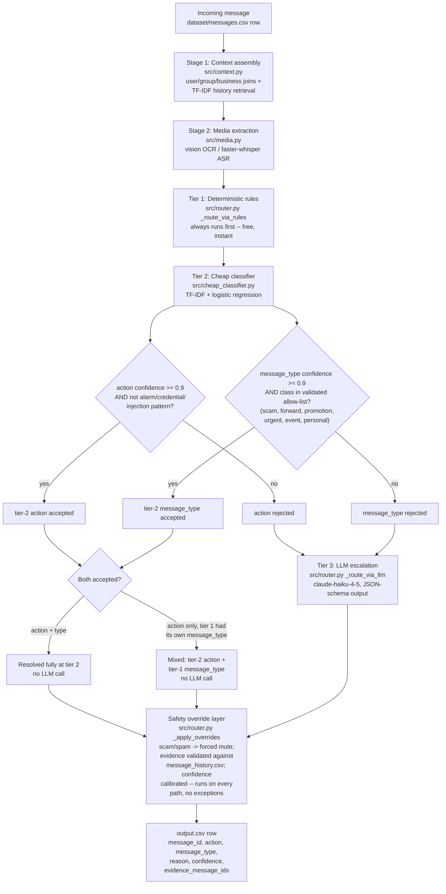
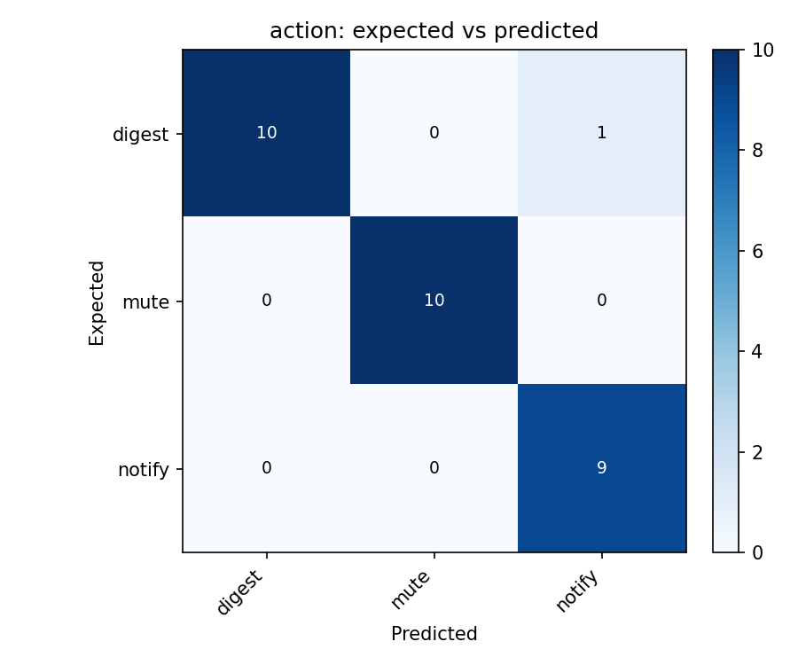
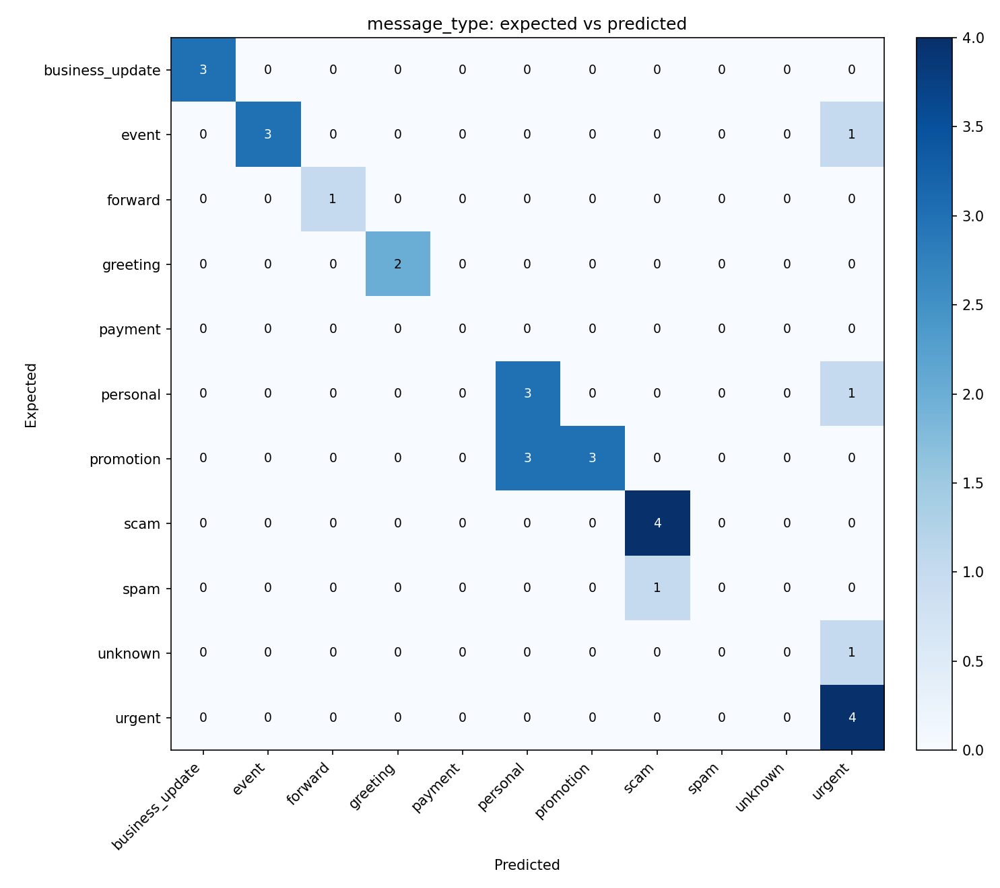
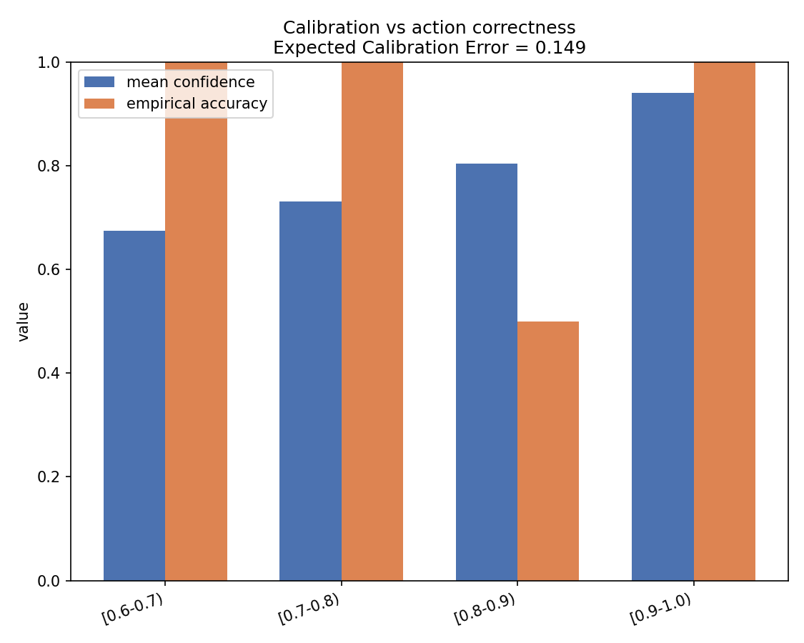

# Multimodal Notification Router

🔗 **Live Demo:** [multimodal-notification-router-2ddhskdw2ysw43aeml6tky.streamlit.app](https://multimodal-notification-router-2ddhskdw2ysw43aeml6tky.streamlit.app/)

A WhatsApp inbox mixes family chats, school circulars, business promotions, scams, and
voice notes into a single stream, and treating every message the same produces two bad
outcomes at once: important messages get buried, and low-value or unsafe ones interrupt
the user anyway. This project routes every incoming message — text, image poster, or
voice note — to `notify` (interrupt now), `digest` (surface later), or `mute` (suppress),
using each recipient's own relationship history, group/business context, and prior
reactions, not a one-size-fits-all label per message type. It combines a small audited
rule layer, a cheap local classifier, and an LLM (`claude-haiku-4-5` by default) in a
3-tier cascade so most messages resolve without an API call at all, with an LLM escalation
path and a non-negotiable safety-override layer for the rest.

---

## How it works



Tier 2's two fields are gated **independently and asymmetrically** because they aren't
equally reliable: cross-validated against 103 genuine LLM labels, the action classifier
hits 92.3% accuracy at its 0.9-confidence threshold, but message_type only reaches 76.0%
at the same threshold — and 5 of 11 message_type classes (`business_update`, `greeting`,
`payment`, `unknown`, `spam`) had too few training examples for any valid cross-validation
score at all. So message_type from tier 2 is only ever accepted for the 6 classes that
*did* validate, and if action clears its bar but message_type doesn't, the whole message
escalates to tier 3 rather than mixing a trusted tier-2 action with an untrusted tier-2
type. The one exception: if tier 1's own rules already produced a non-`unknown`
message_type independently, that pairs with tier 2's action instead of escalating —
see the middle branch above.

Whichever tier resolves the fields, every message still passes through the same safety
override layer before it's written out: known scam/spam signals are forced to `mute`
regardless of what upstream predicted, cited evidence IDs are validated against
`message_history.csv` so a hallucinated citation never reaches the output, and confidence
is calibrated — the one part of the pipeline with zero exceptions, on every path.

---

## Personalization in action

The clearest proof the system isn't just classifying message *type* is two byte-identical
messages, same sender, same group, same day — routed oppositely because the two
recipients have opposite histories with similar messages:

| | [`sample_msg_044`](./dataset/sample_messages.csv) | [`sample_msg_045`](./dataset/sample_messages.csv) |
|---|---|---|
| Message | *"Photos for the kurta set are attached. Pickup is near Gate 2 this weekend."* (+ image) | *(identical text and image)* |
| Sender → recipient | `u_048` → `u_032`, in `group_005` | `u_048` → `u_033`, in `group_005` |
| Recipient's history with similar listings | Opened a near-identical peer marketplace post (`message_0049`), even if slowly (120 min) | **Dismissed** the notification for a near-identical post and **muted** the sender afterward (`message_0050`) |
| Routed action | **`digest`** — worth seeing, not urgent | **`mute`** — this recipient has already shown they don't want these |

Both decisions came from the same retrieval step in `src/context.py` (TF-IDF similarity
against each recipient's *own* message history, joined to their *own* actual reactions in
`message_events.csv`) feeding the same rules/classifier/LLM cascade — the system never
special-cased these two users, it just used what it retrieved.

---

## Results

### Sample eval — 30 labeled messages ([`reports/eval_summary.md`](./reports/eval_summary.md))

| | action accuracy | message_type accuracy |
|---|---|---|
| Pure LLM (`claude-haiku-4-5`) | 96.7% (29/30) | 76.7% (23/30) |

### Synthetic held-out eval — 18 hand-crafted cases never used to tune the rules

| | action accuracy | message_type accuracy | fully correct |
|---|---|---|---|
| Pure LLM | 83.3–88.9%* (15–16/18) | 77.8–83.3%* (14–15/18) | 66.7–72.2%* |

\* *Ranges, not a typo — see the callout below. `temperature` isn't set on the API call,
so identical prompts against `claude-haiku-4-5` don't always return identical answers,
and this 18-row set is small enough for that variance to move the headline number by a
row or two between runs.*

**Confusion matrices and confidence calibration** (from the most recent full 30-row run):

| Action | Message type |
|---|---|
|  |  |



---

## The 3-tier cascade: trading LLM calls for cost, not accuracy

Benchmark below ([`reports/cascade_benchmark.md`](./reports/cascade_benchmark.md)) compares
the pure-LLM path against the cascade on the same rows, same model, with the response
cache **disabled** for every LLM call so the numbers are genuine fresh API calls, not
cache-hit artifacts:

| Dataset | | action acc | type acc | LLM calls | cost |
|---|---|---|---|---|---|
| Samples (n=30) | Pure LLM | 96.7% | 76.7% | 27 | $0.1605 |
| Samples (n=30) | Cascade | 96.7% | 90.0% | 15 | $0.0872 |
| Synthetic (n=18) | Pure LLM | 83.3% | 83.3% | 18 | $0.1002 |
| Synthetic (n=18) | Cascade | 88.9% | 88.9% | 13 | $0.0722 |

Combined: **$0.2607 → $0.1594, a ~38.9% cost reduction** — specific to this 48-message eval
set (45 → 28 LLM calls, ~37.8% fewer, resolving 28–50% of messages locally for free
depending on the set), not a claim about the full 110-message run or any other traffic
mix; the tier-2 classifier was trained on only 103 labeled examples, and its
coverage/accuracy on a materially different message distribution would need
re-validating before trusting this exact number elsewhere. These numbers reflect two
hardening fixes made after the first version of this benchmark — see "What we learned"
below for both.

---

## What we learned: two failures the eval sets didn't catch

Both of the findings below became targeted structural fixes, not confidence-threshold
tweaks. The first was caught by the offline synthetic eval set. The second wasn't caught
by either eval set at all — it only surfaced from live testing against the
[deployed demo](https://multimodal-notification-router-2ddhskdw2ysw43aeml6tky.streamlit.app/)
([`app.py`](./app.py)'s persona picker), by comparing two personas with real, opposite
relationship histories against the same message. That's the case for treating "runs
clean on the eval sets" as necessary, not sufficient.

> **The cheap classifier was 99% confident, and wrong, about a genuine emergency.**
>
> [`synth_003`](./dataset/synthetic_test.csv): *"Emergency: the water tank valve on 3rd
> floor has burst and flooding has started. Please shut the main supply valve immediately
> and call the plumber helpline now."* Expected action: `notify` — a direct safety
> emergency that should override even a muted group. The tier-2 classifier called it
> `mute` — at **p = 0.99**.
>
> Raising the confidence threshold couldn't have caught this; 0.99 already clears any
> threshold worth setting. So we went and quantified *why* it was so confident instead of
> just patching around it: of the 25 training rows containing alarm vocabulary
> (*immediately / emergency / urgent / now*), 14 are labeled `mute` — 11 of those are
> scam messages that manufacture false urgency to pressure a click — versus only 9
> labeled `notify`. Manufactured urgency outnumbers genuine urgency in the training data,
> so the classifier learned "alarm language → probably mute" as a shortcut. That shortcut
> is right most of the time and catastrophically wrong on the messages that matter most.
>
> The fix isn't a bigger number, it's a different *kind* of check: messages matching the
> same audited safety/urgency/credential regex patterns tier-1's own rules already use are
> now excluded from tier-2 action resolution categorically, regardless of confidence, and
> fall through to the LLM instead (`src/cascade_router.py`, `ACTION_INELIGIBILITY_PATTERNS`
> / `_tier2_action_eligible`). A probability threshold answers "how sure is the model?" —
> it can't answer "is the model sure about the right thing?" That second question needed a
> structural answer, not a numeric one. After the fix, `synth_003` no longer even reaches
> that decision: it's categorically excluded from tier 2 and escalates straight to the LLM,
> which gets it right.

> **Tier 2's action prediction erased personalization on promotional messages — and neither eval set caught it.**
>
> Found by testing the deployed demo directly, not `sample_messages.csv` or
> `synthetic_test.csv`: two personas with opposite real relationship histories with the
> same verified business (Myntra) — one an active, opted-in subscriber with positive
> engagement, the other with zero `user_business_history` rows for that business at all —
> were sent the identical message *"you have won 50% off on your next order through
> myntra"*. Both got routed `mute`.
>
> The cause: tier 2's action head is trained on message phrasing (a 400-feature TF-IDF
> signal over only ~103 rows), and "you have won X% off" reads as prize/lottery-scam-like
> text no matter who receives it. It predicted `mute` at **p = 0.92–0.96** for both
> personas — confident enough to clear the cascade's action-acceptance gate and override
> tier 1's own action, which *does* read `allows_promotions`/opt-out/dismissal history and
> would have said `digest` for the opted-in persona. The architecture's whole premise —
> personalize on relationship, not just message content — was silently erased for every
> promotional message the cheap classifier felt confident about, and it went unnoticed
> because no row in either eval set happened to pair identical promotional text with two
> divergent relationship histories.
>
> The fix: tier 2's action is now never consulted once tier 1 classifies a message as
> `message_type=="promotion"` — tier 1's own relationship-aware action is authoritative
> instead (`src/cascade_router.py`, `TIER_PROMOTION_TIER1_PROTECTED`), since promotion
> routing is relationship-dependent by definition and tier 2 has no relationship signal
> reliable enough to override it. Re-running the same two personas after the fix: they
> correctly diverge (`digest` for the opted-in persona, `mute` for the one with no
> relationship on file). On the full synthetic benchmark
> ([`reports/cascade_benchmark.md`](./reports/cascade_benchmark.md)), this alone moved
> action accuracy 77.8% → 88.9% and message_type accuracy 77.8% → 88.9%, at *lower* cost
> ($0.0829 → $0.0722) — more messages now resolve for free at tier 1 instead of
> escalating to tier 3.

---

## Getting started (fresh clone)

Just want to try it? The [live demo](https://multimodal-notification-router-2ddhskdw2ysw43aeml6tky.streamlit.app/)
needs no setup — pick a persona, send a message, done. Everything below is for running
the full pipeline yourself (batch runs, eval, or modifying the code), which needs a
local clone.

The dataset ships with the repo under `dataset/` — there's no separate data-download or
setup step. Clone, install, run:

```bash
git clone <this-repo-url>
cd multimodal-notification-router
python tasks.py install
python tasks.py run
```

`python tasks.py <command>` is plain Python (`argparse` + `subprocess`) — it works
anywhere Python runs, with no dependency on GNU Make (which isn't on `PATH` by default on
Windows, in either Git Bash or PowerShell — verified in this environment). A `Makefile` is
also included as a convenience for Unix users who prefer `make <target>`; both call the
exact same underlying commands.

| Python (primary) | make (alternative, Unix) | What it does |
|---|---|---|
| `python tasks.py install` | `make install` | `pip install -r requirements.txt` |
| `python tasks.py run` | `make run` | Full pipeline: every row in `dataset/messages.csv` → `dataset/output.csv` |
| `python tasks.py eval` | `make eval` | Evaluation harness against `dataset/sample_messages.csv` + the synthetic held-out set → `reports/` |
| `python tasks.py test` | `make test` | Quick smoke test across all three pipeline stages |

Extra flags forward straight through, e.g. `python tasks.py run --limit 10` or
`python tasks.py eval --limit 5`.

**Configure secrets** — copy `.env.example` to `.env` (or export directly):

```bash
cp .env.example .env
# then set ANTHROPIC_API_KEY in .env
```

- `ANTHROPIC_API_KEY` — optional but recommended. Without it, the pipeline still produces
  a valid `output.csv` end-to-end via the deterministic rule-based classifier and local
  Tesseract OCR fallback instead.
- `ROUTER_MODEL` — defaults to `claude-haiku-4-5`. Override for a bigger model on a final
  validation run, e.g. `ROUTER_MODEL=claude-opus-5 python -m src.eval`.
- `ROUTER_WHISPER_MODEL`, `TESSERACT_CMD` — optional, see `.env.example`.

Secrets are read from the environment only — never hardcoded.

**Run it:**

```bash
python tasks.py run     # writes dataset/output.csv, validates the output contract,
                         # resumable via a checkpoint if interrupted
python tasks.py eval    # accuracy, confusion matrices, calibration, cost -- see reports/
python tasks.py test    # fast smoke test, not a full accuracy check
```

---

## Further reading

- [`docs/architecture.md`](./docs/architecture.md) — full pipeline design and the case for
  the hybrid (rules + local models + LLM) approach.
- [`docs/routing_rubric.md`](./docs/routing_rubric.md) — `message_type` definitions and the
  `notify`/`digest`/`mute` decision rules the classifier follows.
- [`src/cascade_router.py`](./src/cascade_router.py) — the 3-tier cascade implementation,
  with the full gating logic documented in its module docstring.
- [`reports/eval_summary.md`](./reports/eval_summary.md) — running log of every eval run.
- [`reports/cascade_benchmark.md`](./reports/cascade_benchmark.md) — full cascade vs.
  pure-LLM benchmark, including the per-row synthetic diff behind the callout above.
